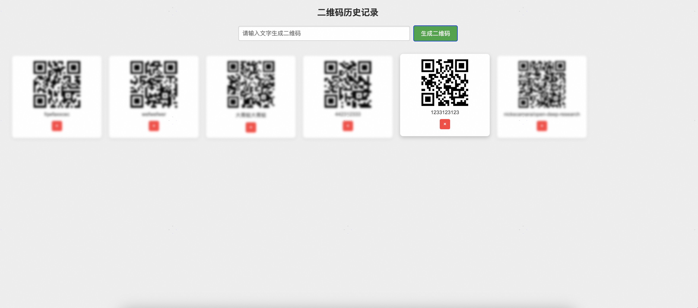

# Text to QR Code Chrome Extension

**Text to QR Code** is a Chrome extension that generates QR codes from selected text on web pages using keyboard shortcuts. It also saves the history of generated QR codes. The extension supports both English and Chinese languages.

## Features

- **QR Code Generation**  
  Select any text on a webpage and press the shortcut key (_default: Ctrl+Shift+1 / Command+Shift+1_) to generate and embed a QR code on the page.

- **History Record**  
  All generated QR codes and their corresponding texts are automatically saved. Click the extension icon to open the history page in a new tab, where all saved QR codes and texts are displayed in a grid layout.

- **Internationalization**  
  Uses Chrome's built-in internationalization API to switch between Chinese and English interfaces based on the browser's language settings.

## Installation

1. Clone or download this project to your local machine.
2. Open Chrome browser and navigate to `chrome://extensions/`.
3. Enable "Developer mode" and click "Load unpacked extension", then select the project root directory.
4. After successful installation, you can select text on any webpage and use the shortcut key to generate QR codes, and click the toolbar icon to view the history page.

## Screenshots

### 1. QR Code Generation Example

  

### 2. History Page

  

## Development and Build

This is a static resource project that can be packaged and continuously integrated through GitHub Actions pipeline if needed.

## License

This project is licensed under the MIT License.
